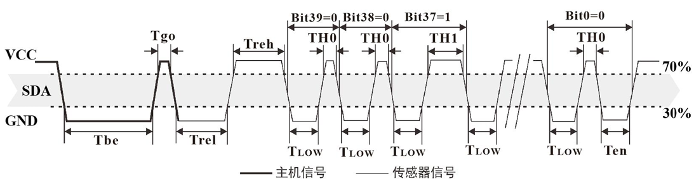

# DHT11驱动开发笔记

## 硬件信息
硬件：dht11，湿度20-90%±5% 温度0-50℃±2℃
通信：单总线通信

dht11驱动开发主要实现功能启动信号、等待响应、读取数据。按照惯例我们首先实现端口初始化，先定义哪个端口来通信

```c
#define PIN_DA GPIO_Pin_2
#define GPIOX_DA GPIOB
#define RCC_DA RCC_APB2Periph_GPIOB
```

然后对端口进行初始化，输入模式、输出模式。

### 输出模式：
```c
GPIO_InitTypeDef GPIO_InitStructure;
RCC_APB2PeriphClockCmd(RCC_DA, ENABLE);
GPIO_InitStructure.GPIO_Pin = PIN_DA;	 
GPIO_InitStructure.GPIO_Mode = GPIO_Mode_Out_PP; 		 
GPIO_InitStructure.GPIO_Speed = GPIO_Speed_50MHz;
GPIO_Init(GPIOX_DA, &GPIO_InitStructure);
```

### 输入模式：
```c
GPIO_InitTypeDef GPIO_InitStructure;
GPIO_InitStructure.GPIO_Pin = PIN_DA;
GPIO_InitStructure.GPIO_Mode = GPIO_Mode_IPU;
GPIO_InitStructure.GPIO_Speed = GPIO_Speed_50MHz;
GPIO_Init(GPIOX_DA, &GPIO_InitStructure);
```

在dht11数据手册中给出了dht11的通信时序：

从通信时序是中可以看出，首先是主机发送启动信号（拉低20ms（18-23），拉高13us（10-35））；传感器收到启动信号以后向主机发送响应信号（拉低83us（78-88）拉高87us（80-82））；然后开始向主机发送40个比特的数据。接下来开始实现发送启动信号函数和等待响应函数。

### 发送启动信号函数
```c
GPIO_WriteBit(GPIOX_DA,PIN_DA,Bit_RESET);
Delay_ms(20);
GPIO_WriteBit(GPIOX_DA,PIN_DA,Bit_SET);
Delay_us(13);
```

### 等待响应函数
```c
uint8_t num = 0;
while(!GPIO_ReadInputDataBit(GPIOX_DA,PIN_DA)){
    num++;
    Delay_us(1);
    if (num>100) return 0;
}
num = 0;
while(GPIO_ReadInputDataBit(GPIOX_DA,PIN_DA)){
    num++;
    Delay_us(1);
    if (num>100) return 0;
}
return 1;
```

正常情况下等待响应信号结束，返回1。如果长时间未响应则返回0。

dht11在响应完信号后会发送5个字节（40个比特）给主机：
湿度整数——湿度小数——温度整数——温度小数——校验码
数据表示："0" 拉低54us，拉高23-27us； "1" 拉低54us， 拉高68-74us。

读取数据的关键点就在于检测数据线被拉高的时间
```c
while(GPIO_ReadInputDataBit(GPIOX_DA,PIN_DA)){
    num++;
    Delay_us(1);
    if(num>100){
        *temp = 0;
        *hum = 0;	
        return ;
    }
}
data[i/8] <<= 1;
if(num>0 && num<20){
}
else if(num>20 && num<50){
    data[i/8] += 1;
}
```

根据实际测试加上代码执行时间和延时，数据"0"一般要10-11个循环，数据"1"一般要30-31个循环。我这里多给他一个时间范围（0-20）（20-50），是为了兼容差错，起始可有可无。

如果不想用这种方法，可以将代码直接延时27-68us中间的任意时间，如果这个时间检测出来为高电平，说明数据为1。总之，灵活变通吧。

收到所有数据以后按流程使用校验码检测一下数据是否出错
湿度整数+湿度小数+温度整数+温度小数=校验码
```c
if(data[0]+data[1]+data[2]+data[3] == data[4]){
    *temp = data[2];
    *hum = data[0];
}
```

dht11驱动开发实现相对简单，命令也简单。
